# Developer Documentation

## How to build, test, and run the project
Clone the repository and open the CodeDuplicationChecker solution file in Visual Studio. 

### Build
1. From the Solution Explorer in Visual Studio, right click the solution at the top and click "Build solution" (you can also just do Ctrl + Shift + B or F6).

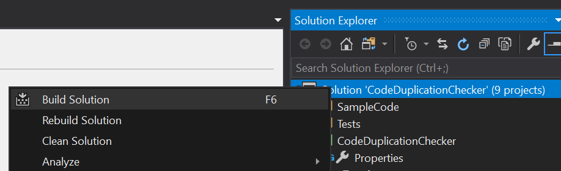

### Test
1. In Visual Studio, open the Test Explorer window by going to Test -> Windows -> Test Explorer (or do Ctrl + E, T). 

2. At the top, click "Run all" (or just do Ctrl + R, A).

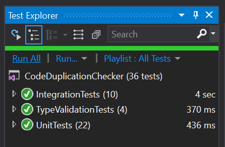

### Run
#### Windows Forms UI
1. At the top of Visual Studio, in the dropdown next to the "Start" play button, select CodeDuplicationCheckerApp. 

Alternatively, right click the CodeDuplicationCheckerApp project in the Solution Explorer and click "Set as Startup Project". 

2. Then click "Start" (or do F5 for debugging, Ctrl + F5 for without debugging).

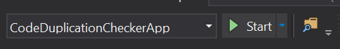

#### Command Line
1. At the top of Visual Studio, in the dropdown next to the "Start" play button, select CodeDuplicationChecker. 

Alternatively, right click the CodeDuplicationChecker project in the Solution Explorer and click "Set as Startup Project". 

 

2. Open the Properties for the project by double clicking the Properties file in the Solution Explorer. 

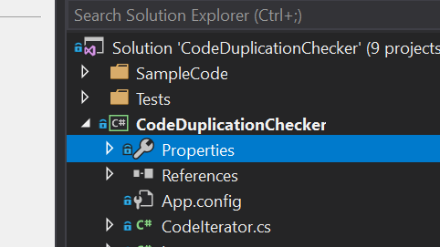

3. Set the command-line arguments you'd like to pass in using the Debug tab. 

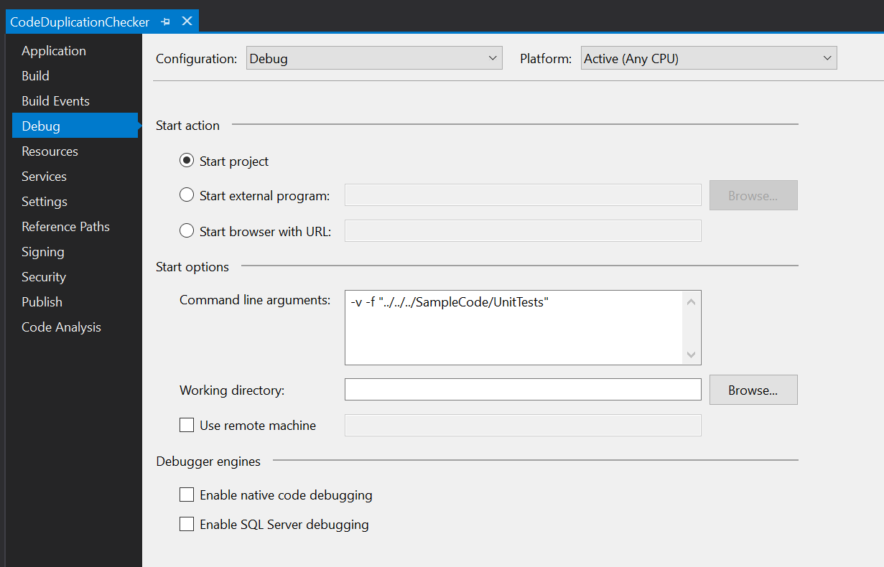

4. Then click "Start" (or do F5 for debugging, Ctrl + F5 for without debugging). 

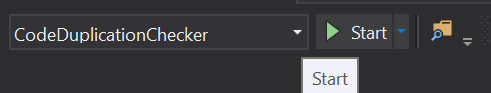

To see the results, go to the root directory of the project in your file explorer -> Results -> open results.html. 

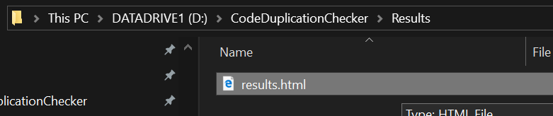

You may also want to place a breakpoint at the end of the Main program to see the debugging output in the console window.

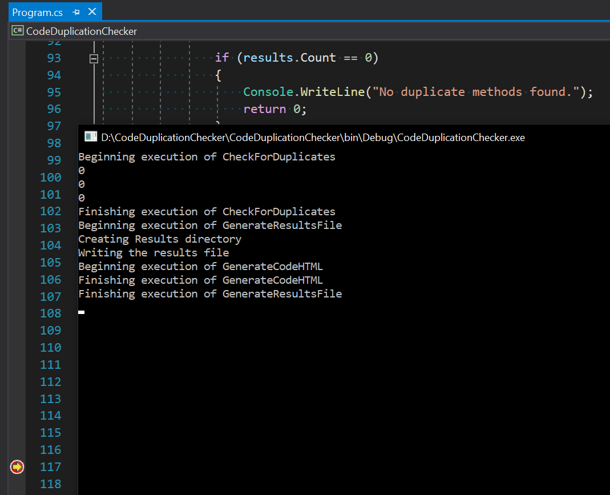

## Major Design Decisions
We implemented the project in C# using Visual Studio due to familiarity with the language and the tools. This allowed us to use a simple console application as the user interface during development and expand to a more powerful Windows Forms UI later in the project. We chose to use Windows Forms for displaying the results of the CMCD algorithm because it was a good way to show the methods we had compared, their similarity scores, and enable clickthrough to the code visualization. 

For the visualization of the results, we decided to generate an HTML file and highlight the diffs in the clones with CSS because that would be the easiest way to replicate common visualization techniques (such as in Visual Studio, git diffs) for a visualization most familiar to the average developer. The visualization highlights the diffs and includes the filenames, start and end lines of the code clones so that the developer is empowered to seek the clones out and refactor them into a common method. 

We implemented the original CMCD algorithm and then added 13 additional features on top of the original 13, which we believe will help in clone detection in industry settings. These include features such as first, second, and third level member accessed, defined by other variable, defined by numeric, boolean, or null literal expression, and so on.

In addition to the CMCD algorithm, we implemented a naïve string comparer which uses Levenshtein Distance so we could compare the two approaches' efficacy. We placed this algorithm and the CMCD algorithm in different projects so that the two were as independent and modular as possible. We defined an interface called ICodeComparer which has one Compare method in it, and then made both the algorithms implement this interface so the specific instance of algorithm could be chosen at runtime. From the command-line interface, this is done using the -a or --algorithm command-line options. We did not have time to integrate this feature into our Windows Forms UI, but this would be an easy enhancement to add.

We implemented the Code Iterator such that the program could take either a filepath or a filename and run the algorithms over either a single file, or all of the files in a folder (including sub-directories). We decided not to take in something like a Visual Studio csproj (project) file or a Visual Studio sln (solution) file to allow for the maximum amount of flexibility. We didn't want to constrain our users to using Visual Studio as their IDE in order to use our tool to examine duplicates in their codebase. Furthermore, an entire project or solution might prove too massive in industry settings for our tool to reasonably operate over; therefore, having the ability to scope the tool down to a specific file (which might in itself be very large) or a single folder allows the user the maximum amount of control.

## Style Guidelines
We organized all of the sample code in a SampleCode folder at the root directory in order to make it as accessible as possible from all parts of the codebase (unit tests, Windows Forms UI, command-line interface). Similarly, we grouped all of the testing projects together into a Tests folder in the Visual Studio solution in order to organize the codebase for easy navigation. If you are going to add sample code or tests to the repo, please adhere to this organization. Similarly, if you would like to add a new algorithm to compare against the existing (Naive string comparison, CMCD), please do so in a separate project and by implementing the ICodeComparer interface, so that the implementations may be kept as independent as possible. Another thing to note is that we have organized interfaces and models into their respective Interfaces and Models projects. When adding files of this variety, please group them under these projects as appropriate.

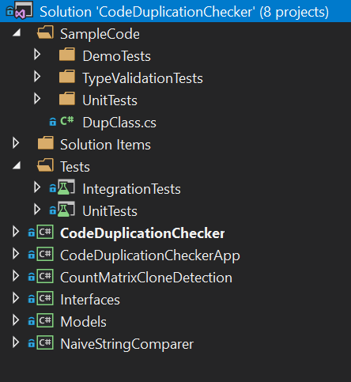

When it comes to the code itself, we generally follow Visual Studio's default recommended style guidelines. If Visual Studio suggests that you refactor your code (usually represented by three grey dots below the offending code, as in the screenshot below), we generally recommend that you fix the code according to the suggestion (hover over the three dots or press Ctrl + . to see the suggestion).

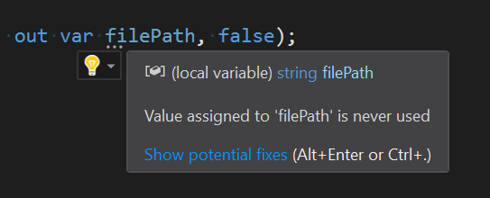

A few small things we will note, however, is that we prefer the use of the 'var' keyword where the type of the variable is obvious, and we prefer camel case to underscores. We prefer switch statements to long chains of if/else statements. In general, methods should have a summary above them detailing what the method does, its inputs and its return object. If a function is not used outside of the class or assembly, it should be marked as "internal" (NOT private - see Testing Private Methods below). When writing multiple tests for the same method, we recommend you name the test method as NameOfMethod_TestCase_Test, e.g. CheckForDuplicates_Dir_Test and CheckForDuplicates_File_Test, GenerateResultsFile_Type1_Test and GenerateResultsFile_Type2_Test, etc. Furthermore, the name of the test class should be the name of the class under test followed by Tests, i.e. VisualizeDiffsTests, and the namespace should be that of the namespace under test followed by .UnitTests or .IntegrationTests, such as CodeDuplicationChecker.UnitTests or CodeDuplicationChecker.IntegrationTests. This allows for the most cogent organization of tests and avoids duplicate namespaces (see below). Please also organize your test methods into the three sections by comments, e.g. Arrange, Act, and Assert. 

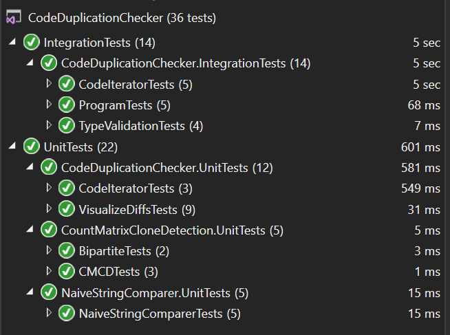

## Testing Infrastructure
The testing infrastructure consists of .NET Framework unit tests. Some of these are strictly unit tests and some are used as integration tests, testing how multiple modules connect together. In general, the test projects are located in the "Tests" folder, unit tests are arranged under the UnitTests project, and integration tests are arranged under the IntegrationTests project. Any tests which do not fall into these two categories may require a separate testing project.

### Adding New Tests
To add new tests, first determine if you need to create a new test project or file. We ask that you please use the UnitTests project for unit tests and the IntegrationTests project for integration tests. Any new type of test may require a new test project.

#### To create a new test project:
1. Right click on the Tests folder -> Add -> New Project

2. In the window which pops up, type "Test" in the search box and select the "Unit Test Project (.NET Framework)" option. Then click Next.

3. Configure the settings for your new project, and then click "Create"

#### To create a new test file:
1. Right click on the test project you'd like to add to -> Add -> Unit Test…

2. This will create the new file. Edit the filename, class name and namespace if necessary, and get to writing those tests!

#### Automatically create tests using Visual Studio:
An alternative option is to let Visual Studio create the test project/file/class/methods for you.
1. Go to the class/method you would like to test
2. Right click the name of the class/method
3. Select "Create unit tests"

3. Fill out the details for your new test project, file, class, and/or methods, and click "OK"

4. This will create the test project, file, class, and methods for you. Now get to writing those tests!

#### Testing Private Methods

In order to test private methods in C#, follow the steps below:

1. Mark the method as "internal" instead of "private". This means that it is internal to the assembly only. See [here](https://docs.microsoft.com/en-us/dotnet/csharp/language-reference/keywords/internal) for more details.

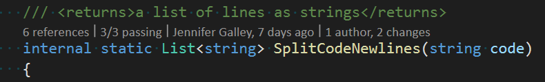

2. In the AssemblyInfo.cs file for the project, add a tag for "InternalsVisibleTo" and type or select the name of the test project.

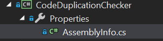

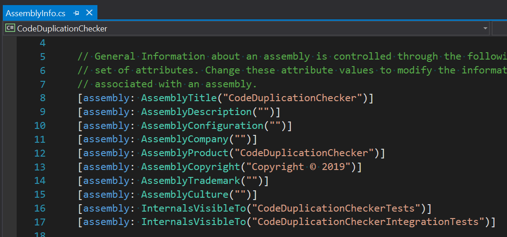

3. You should now be able to test the otherwise private method!

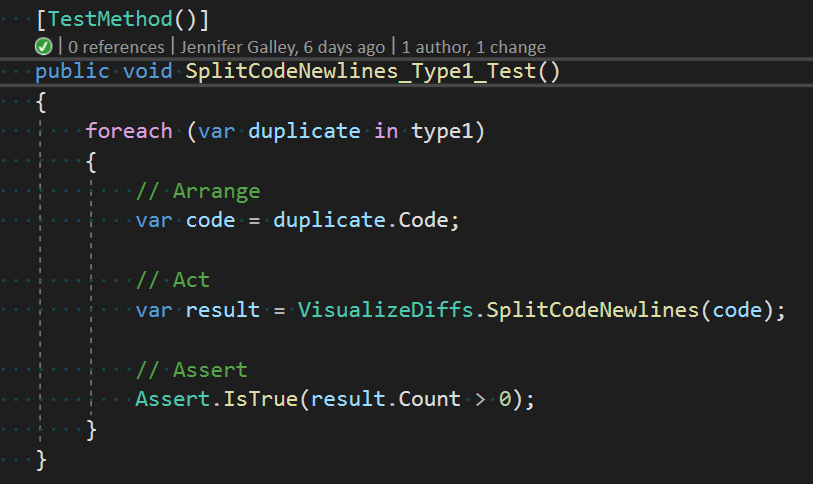